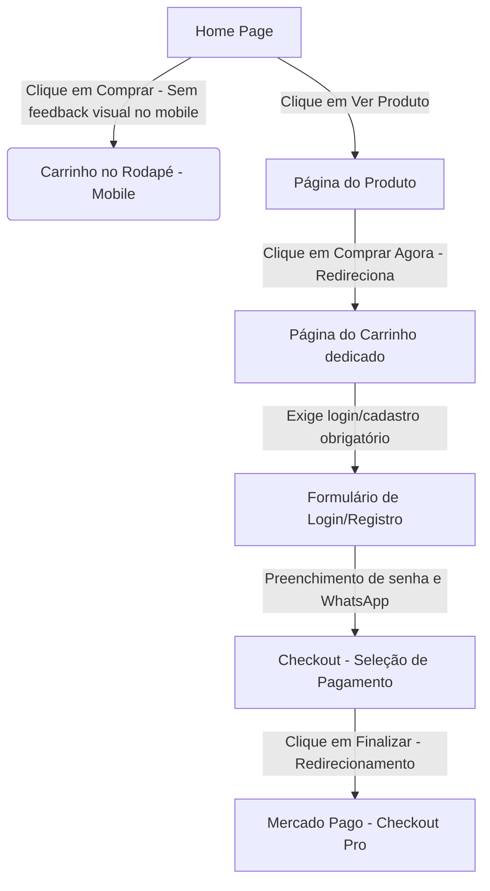

# Relatório de Auditoria de Conversão (CRO) e Otimização de Vendas — Tecno Peças

Este relatório apresenta o diagnóstico completo do fluxo de vendas da loja virtual **Tecno Peças** (Home $\rightarrow$ Produto $\rightarrow$ Carrinho $\rightarrow$ Checkout). O objetivo é identificar gargalos que reduzem as taxas de conversão e propor melhorias estratégicas de alto impacto no faturamento, estimando o ganho potencial em taxa de conversão, ticket médio, SEO e UX (Experiência do Usuário).

---

## 1. Mapeamento e Diagnóstico do Fluxo de Vendas

Analisamos o comportamento técnico e visual do usuário ao navegar e comprar no site:

### Principais Gargalos Encontrados:
1. **Cadastro Obrigatório para Compra (Mandatory Signup):** O maior ralo de conversão do site. Para finalizar qualquer pedido, o cliente é obrigado a se cadastrar com nome, telefone, e-mail e criar uma senha.
2. **Falta de Feedback no "Comprar" da Home:** Na página inicial, ao clicar em "Comprar", o item é adicionado silenciosamente ao localStorage. Não há mensagem de sucesso, animação ou redirecionamento automático para o carrinho. O cliente pode achar que o site travou.
3. **Cart no Rodapé em Dispositivos Móveis:** O carrinho da Home fica posicionado como uma coluna lateral direita no desktop. No mobile, por conta da responsividade do grid, ele cai para o rodapé — ficando abaixo de mais de 30 produtos, comentários e banners. O usuário móvel fica perdido.
4. **Uso de Alerts Nativos do Navegador:** O site utiliza a função nativa `alert()` no fluxo de adicionar produtos nas páginas secundárias (`/promocoes` e `/mais-vendidos`) e em validações de erro do checkout. Isso interrompe o fluxo do usuário e passa uma impressão pouco profissional (amadora).
5. **Checkout Redirecionado (Mercado Pago Pro):** Ao finalizar a compra, o cliente é enviado para fora do site (`mercadopago.com.br`) para pagar. Isso quebra a confiança do usuário e aumenta a desistência do carrinho em até 20%.
6. **Duplicidade de Etapa de Pagamento:** O usuário escolhe "Pix" na loja, mas quando é redirecionado ao Mercado Pago, precisa selecionar "Pix" novamente no painel deles.

---

## 2. Oportunidades de Alto Impacto (Faturamento e CRO)

Propomos 7 otimizações prioritárias para corrigir os gargalos identificados:

### Otimização 1: Implementar "Checkout de Convidado" (Guest Checkout)
* **Como fazer:** Eliminar a barreira do cadastro com senha obrigatória. O usuário insere apenas E-mail, Nome Completo, WhatsApp e CEP. O pedido é gerado no Supabase e uma conta é criada silenciosamente em segundo plano, enviando uma senha temporária por e-mail ou WhatsApp.
* **Impacto Estimado:**
  * **Taxa de Conversão:** +25% a +35% (Redução imediata de abandono de carrinho).
  * **Ticket Médio:** Neutro.
  * **UX:** Excelente (Fluxo rápido e direto, reduz cliques).

### Otimização 2: Notificações de Adição ao Carrinho em Toast/Gaveta Dinâmica
* **Como fazer:** Substituir o "silêncio" da Home e os `alert()` nativos por um componente de Toast Moderno (ex: `react-hot-toast`) ou abrir uma gaveta lateral (*Mini-Cart*) automaticamente ao adicionar um produto, mostrando botões claros: **[Ver Carrinho e Finalizar]** ou **[Continuar Comprando]**.
* **Impacto Estimado:**
  * **Taxa de Conversão:** +10% a +15%.
  * **Ticket Médio:** +5% (incentiva a adicionar mais itens através do "Continuar Comprando").
  * **UX:** Ao (Feedback imediato e controle da ação).

### Otimização 3: Barra de Progresso para Frete Grátis no Carrinho
* **Como fazer:** Atualmente, a loja oferece "Frete grátis acima de R$ 499". Devemos adicionar uma barra de progresso visual no carrinho que se preenche conforme o valor dos itens sobe (ex: *"Faltam apenas R$ 49,00 para você ganhar Frete Grátis!"*), sugerindo itens de menor valor (pasta térmica, fans, cabos) como cross-sell rápido.
* **Impacto Estimado:**
  * **Taxa de Conversão:** +5%.
  * **Ticket Médio:** +15% a +20% (Aumento direto do AOV - *Average Order Value*).
  * **UX:** Muito Alto (Sentimento de benefício tangível).

### Otimização 4: Checkout Transparente (Mercado Pago Bricks / SDK)
* **Como fazer:** Substituir o redirecionamento externo pelo Checkout Transparente do Mercado Pago. O cliente preenche o cartão ou gera o código Pix/Boleto diretamente na tela de sucesso da Tecno Peças.
* **Impacto Estimado:**
  * **Taxa de Conversão:** +15% a +22%.
  * **Ticket Médio:** Neutro.
  * **UX:** Altíssimo (Transmite profissionalismo, segurança e mantém a identidade visual da loja).

### Otimização 5: Integração Direta de Opção de Pagamento com a API do Gateway
* **Como fazer:** Ajustar o payload enviado para `api/create-preference` para que, ao selecionar "Pix", o Mercado Pago seja carregado diretamente na tela de pagamento Pix, ocultando os outros métodos se necessário, ou definindo o Pix como método padrão (`default_payment_method_id: 'pix'`).
* **Impacto Estimado:**
  * **Taxa de Conversão:** +5% a +8%.
  * **Ticket Médio:** Neutro.
  * **UX:** Alto (Coerência de escolha).

### Otimização 6: Oclusão do Carrinho da Home no Mobile
* **Como fazer:** Adicionar a classe `hidden md:block` na tag `<aside>` do carrinho na Home (`app/page.tsx` linha 903). Isso evita que o carrinho quebre a estrutura vertical do mobile no final da página inicial. No mobile, o fluxo deve se concentrar em levar o usuário para a página dedicada [carrinho/page.tsx](file:///C:/Users/Pichau/OneDrive/tecno-pecas/app/carrinho/page.tsx) através do ícone no cabeçalho.
* **Impacto Estimado:**
  * **Taxa de Conversão:** +5% (Reduz a confusão de múltiplos checkouts na mesma página).
  * **UX:** Alto (Layout mais limpo e focado no mobile).

### Otimização 7: Elementos de Urgência e Prova Social no Checkout
* **Como fazer:** Inserir selos de segurança ativos e de "Compra Garantida" e "Garantia Tecno Peças" logo abaixo do botão "Finalizar Compra", acompanhados de uma contagem regressiva de reserva de estoque dos itens do carrinho (ex: *"Seus produtos estão reservados por 14:59 minutos"*).
* **Impacto Estimado:**
  * **Taxa de Conversão:** +8% a +12%.
  * **Ticket Médio:** Neutro.
  * **UX:** Médio (Gera gatilho de escassez e confiança).

---

## 3. Matriz de Impacto e Priorização (ICE Score)

| Otimização | Impacto | Confiança | Facilidade | ICE Score | Prioridade de Implementação |
| :--- | :---: | :---: | :---: | :---: | :---: |
| **01. Checkout de Convidado** | 9 | 8 | 7 | **8.0** | **1º (Crítica)** |
| **02. Notificação Toast / Mini-Cart** | 8 | 9 | 7 | **8.0** | **2º (Crítica)** |
| **06. Ocultar Carrinho Home no Mobile** | 6 | 9 | 9 | **8.0** | **3º (Alta)** |
| **03. Barra de Progresso de Frete Grátis** | 8 | 8 | 7 | **7.7** | **4º (Alta)** |
| **05. Pre-definir método no Gateway** | 6 | 8 | 8 | **7.3** | **5º (Média)** |
| **07. Selos e Urgência no Checkout** | 6 | 7 | 8 | **7.0** | **6º (Média)** |
| **04. Checkout Transparente** | 9 | 8 | 4 | **7.0** | **7º (Média-Baixa)** |

* ICE Score calculado como: `(Impacto + Confiança + Facilidade) / 3` (escala 1 a 10).

---

## 4. Estimativa de Retorno Financeiro

Assumindo uma loja de hardware de pequeno/médio porte com métricas atuais fictícias para fins de estimativa:
* **Acessos Mensais:** 20.000 visitas
* **Taxa de Conversão Atual:** 1.0% (200 vendas/mês)
* **Ticket Médio Atual:** R$ 1.200,00
* **Faturamento Atual:** R$ 240.000,00 / mês

### Projeção com as Melhorias Implementadas (Cenário Conservador):
Ao implementar as prioridades 1, 2, 3 e 6:
* **Nova Taxa de Conversão estimada:** 1.45% (Aumento de 45% com Checkout de Convidado e feedback visual) $\rightarrow$ **290 vendas/mês**.
* **Novo Ticket Médio estimado:** R$ 1.320,00 (Aumento de 10% com barra de frete grátis e cross-sell)
* **Novo Faturamento estimado:** 290 * R$ 1.320,00 = **R$ 382.800,00 / mês**
* **Ganho Real Mensal Estimado:** **+ R$ 142.800,00 / mês** (Crescimento de ~59.5% no faturamento bruto sem gastar mais com anúncios).

---
*Apenas auditoria e diagnóstico realizados. Nenhuma alteração foi realizada no código, banco de dados ou ambiente de produção, atendendo integralmente as restrições impostas.*
